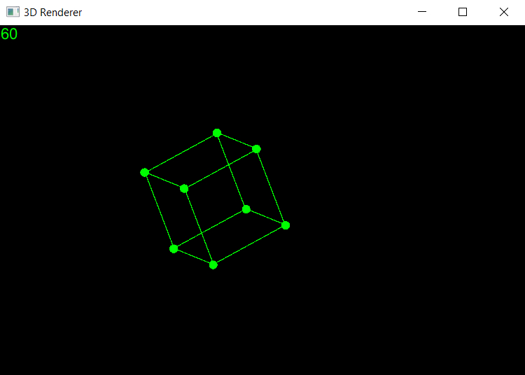

# Simple V Cube Renderer

## A simple 3d cube renderer written in V lang, based on CodingTrain programming challenge.
### This is a toy project to start learning this promising programming language. Any improvement to the base code is appreciated!